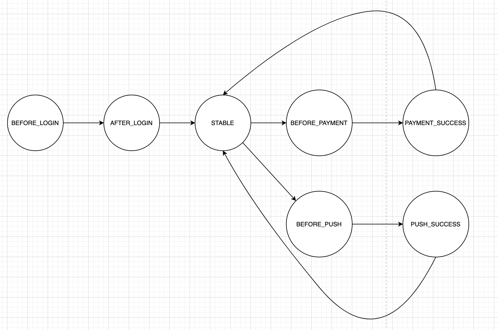
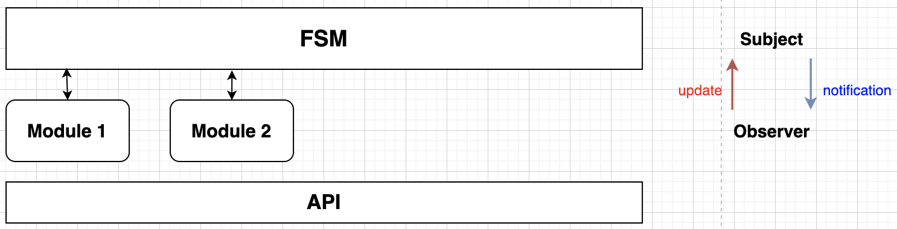
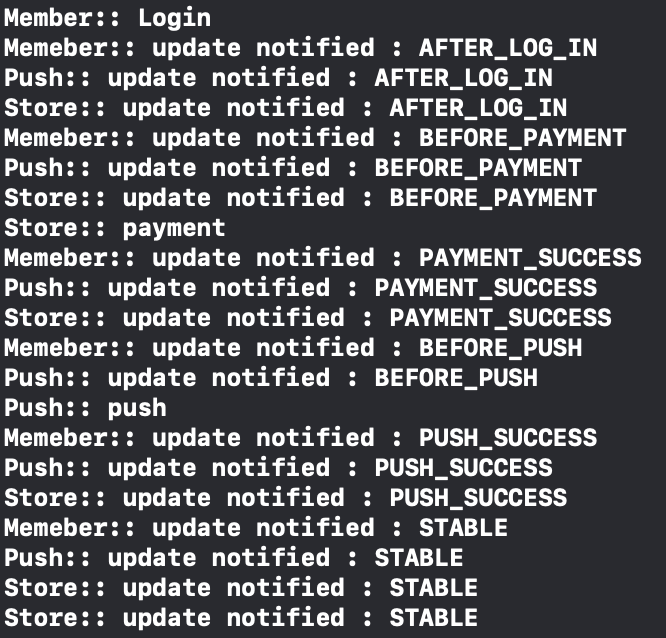

# FSM과 Observer pattern을 이용한 모듈별 흐름제어 관리

## FSM 이란

Finite State Machine, 직역하자면 유한상태머신이다.

FSM은 다음과 같은 특징을 갖고 있다.

* FSM은 자신이 취할 수 있는 유한한 갯수의 상태들을 가진다.
* 그리고 그 중에서 반드시 하나의 상태만 취한다.
* 현재상태는 특정 조건이 되면 다른 상태로 변할 수 있다.
* FSM은 가능한 상태들의 집합과 각 상탣르의 전이 조건으로 정의 될 수 있다.
* 상태들의 노드와 그 노드들을 연결하는 그래프로 표현할 수 있다.

출처: https://ozt88.tistory.com/8


## FSM과 Observer pattern 적용

복작한 State와 흐름의 경우 State Desing Pattern을 사용해야 하지만 일단은 FSM과 Observer pattern만을 이용해 간단한 흐름제어를 해보려고 한다.

우선 만들고자 하는 상태 머신은 다음과 같다.




다음은 직접 구동되는 예시 프로젝트를 만들도록한다.

아래 처럼 FSM이 Subject 역할을 하고 그외 모듈들이 FSM을 구독하고 있는 Observer가 된다.




##  구현

### Core

Core에  FSM이 있다 가정하고 이를 핸들링하는 코드이다.

```swift
import Foundation

public protocol Observer {
    func update()
}

public protocol Subject {
    var observers: [Observer] {get set}
}
extension Subject{
    public mutating func attach(observer: Observer){
        self.observers.append(observer)
    }
    
    func notifyObservers(){
        self.observers.forEach { (ob) in
            ob.update()
        }
    }
}

@objc open class Core: NSObject {
    @objc public static var shared = Core()
    
    public var observers: [Observer] = []
    
    private var currentState: State = .BEFORE_LOG_IN
    public var state: State{
        get{
            return self.currentState
        }
        
        // State가 set 되자마자 notification
        set(newVal){
            self.currentState = newVal
            self.notifyObservers()
        }
    }
    
    private override init() {
        super.init()
    }
}

extension Core: Subject{
    public enum State{
        case BEFORE_LOG_IN
        case AFTER_LOG_IN
        case STABLE
        case BEFORE_PAYMENT
        case PAYMENT_SUCCESS
        case BEFORE_PUSH
        case PUSH_SUCCESS
    }
}
```

FSM이 있는 Core에 Subject를 채택하고 state 값이 변경될 때 마다 Subject의 `notifyObservers` 메서드를 호출한다.


### Member, Store, Push

**Member**

```swift
import Foundation
import Core

public class Member: Observer{
    public static var shared = Member()
    
    var core = Core.shared
    
    private init() {
        self.core.attach(observer: self)
    }
    
    // MARK: Subject를 통해 notify를 받는 곳
    public func update() {
        print("Memeber:: update notified : \(self.core.state)")
    }
    
    public func login(){
        print("Member:: Login")
        
        // Login Successed
        self.core.state = .AFTER_LOG_IN
        self.core.state = .BEFORE_PAYMENT
    }
}
```

Member의 경우 인스턴스가 생성될 때 observer에 자기자신을 등록하도록 한다.

`update` 메서드는 Subject를 통해 notificaiton을 받았을 경우 호출되는 메서드이다.


**Store**

```swift
import Foundation
import Core

public class Store: Observer{
    public static var shared = Store()
    var core = Core.shared
    
    private init() {
        self.core.attach(observer: self)
    }
    
    // MARK: Subject를 통해 notify를 받는 곳
    public func update() {
        print("Store:: update notified : \(self.core.state)")
        
        let state = self.core.state
        
        // 로그인 성공했다면 payment 진행
        switch state {
        case .BEFORE_PAYMENT:
            self.payment()
            break
        default:
            break
        }
        
    }
    
    public func payment(){
        print("Store:: payment")
        
        self.core.state = .PAYMENT_SUCCESS
        self.core.state = .BEFORE_PUSH
    }
}
```

Store의 경우 기본적으로 Member와 같지만 notification을 받았을 경우 state에 따라서 동작하게 구현했다.

로그인이 성공할 경우 Member쪽에서 state를 변경할 것이고, state가 변경됨에 따라 observer들에게 notify가 간다. 

이때 Store는 PAYMENT할 준비가 되어있는 상태라면 payment를 진행하게 된다.


### API 및 호출

**API**

```swift
import Foundation
import Member
import Push
import Store

public class API{
    public static var shared = API()
    
    var member = Member.shared
    var push = Push.shared
    var store = Store.shared
    
    private init(){
        
    }
    // login
    public func login(){
        Member.shared.login()
    }
}
```


**FSMSample/AppDelegate.swift**

```swift
import UIKit
import API


@UIApplicationMain
class AppDelegate: UIResponder, UIApplicationDelegate {


    func application(_ application: UIApplication, didFinishLaunchingWithOptions launchOptions: [UIApplication.LaunchOptionsKey: Any]?) -> Bool {
        // Override point for customization after application launch.
        
        // api를 통해 login 시도 시
        API.shared.login()
        
        return true
    }
}
```


## 결과 및 결론

### 결과



결과는 로그인을 시도함에 따라 각 state가 변경됨에 따라서 구독중인 모든 observer들에게 notify가 갈 것이고, observer들은 state에 따라서 정해진 일을 수행하게 된다.


### 결론

모듈화된 SDK에서 각 API는 정해진 일을 하게 된다. 근데 그  API가 하나의 모듈만을 사용해서 만들어진 기능이 아닐 것이다.

이 경우 흐름제어가 한곳에서 이루지지 않는다면 코드를 짤 때 상당히 고민을 해야한다. 모듈간 Circular Depency 이슈와 Callback 메서드에 의해 동작되는 흐름등 파악하기가 힘들것이다.

흐름제어를 한곳에서 해주고 한페이지에서 모든 API의 흐름을 볼 수 있다면 나중에 흐름파악하기 쉬울 것이고, 어느곳에서 버그가 발생하는지 더욱 찾기가 쉬울 것으로 기대된다.

